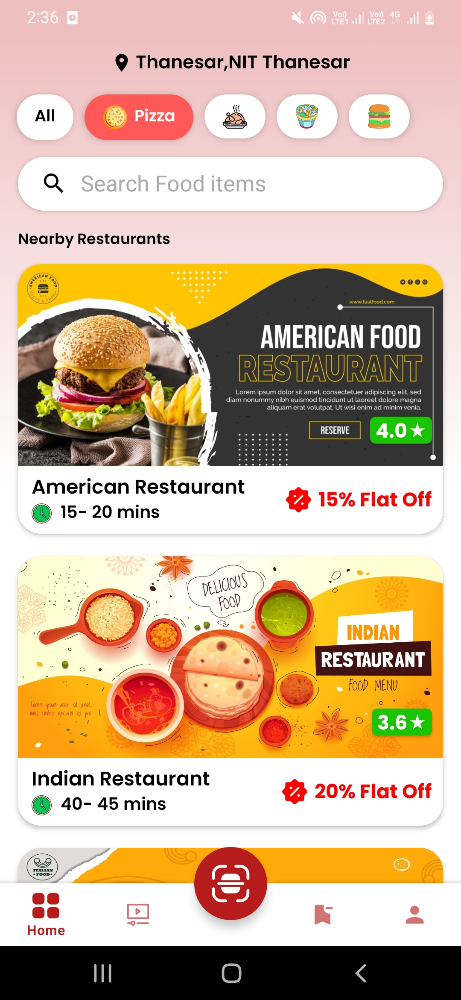
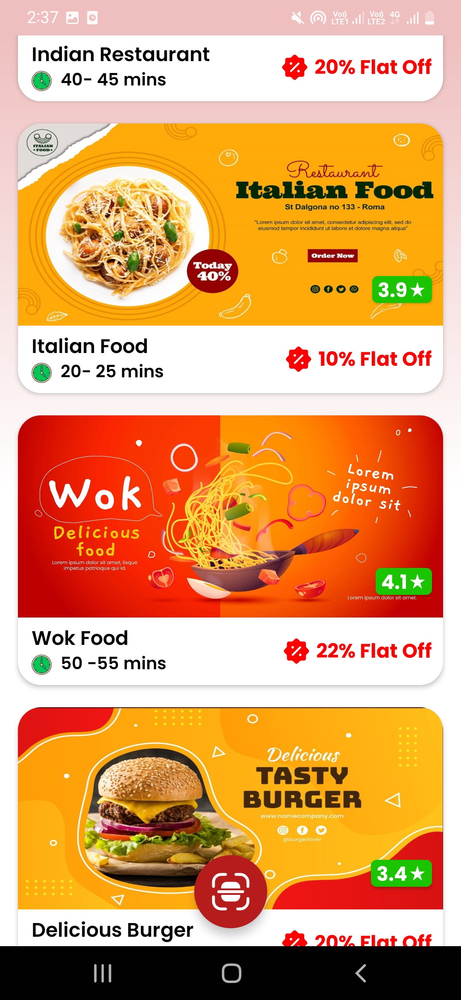

# Food Delivery App

   

## About
This is a multi-feature food delivery app designed to help users find nearby restaurants and order food conveniently. It utilizes Android development basics and focuses on core functionalities and features for a smooth user experience.

---

## Prerequisites
1. **Android Basics**: Familiarity with project structure, creating a basic "Hello World!" app.
2. **Java Basics**

---

## Features
- 📍 Fetches and displays the user's current geo-location.
- 🌐 API integration to fetch restaurants nearby the user's location.
- 📋 Displays restaurant information in a RecyclerView.
- 🔍 SearchView for searching restaurants.
- 📱 Bottom App Bar for seamless screen navigation.

---

## Techniques Used
- **RecyclerView**
- **ToolBar**
- **CardView**
- **Volley**
- **JSON Parsing**
- **ListView**
- **NestedScroll**
- **DrawerLayout**
- **ActionBarDrawerToggle**
- **Floating Action Button**
- **Fragments**
- **Geolocation Fetching**

---

## Screenshots
Here are some screenshots of the app:

  
  

---

## Developed By
- **Author**: Ahmed Samir
- **Email**: [administrator@webveli.com](mailto:administrator@webveli.com)

---

## Contact Us
For further questions or clarifications, feel free to connect with me on:

---

## Contact Support
[Contact Us on Facebook](https://www.facebook.com/BloodServer)

---

> **Note**: Replace `home_1.jpg` and `home_2.jpg` with the actual paths of your screenshots if they are located in a specific folder in your project.
